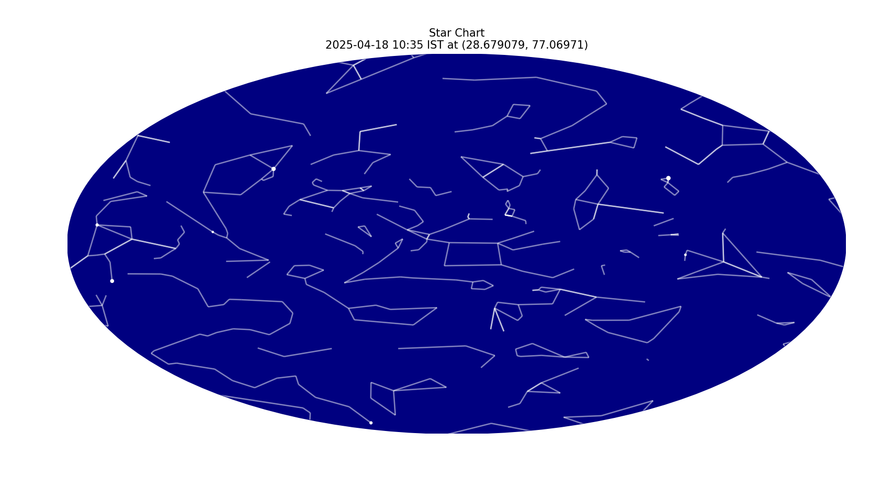

# 🌌 Star Chart Generator

Generate beautiful, real-time star charts based on any location and date using Python and [Skyfield](https://rhodesmill.org/skyfield/).




## 📋 Features

- Generates star charts based on:
  - Latitude & longitude
  - Date
  - Timezone
- Shows:
  - Bright stars
  - Constellation lines
- Uses the **Hipparcos star catalog** and **Stellarium constellation outlines**
- CLI interface – easy to script or automate

---

## 📥 Required Downloads

Before running the script for the first time, you’ll need to download the following datasets used by Skyfield:

### 1. DE421 Planetary Ephemeris
Download link:
```
https://naif.jpl.nasa.gov/pub/naif/generic_kernels/spk/planets/de421.bsp
```

Save it in the same folder as your script, or let Skyfield cache it automatically on first run.

### 2. Hipparcos Star Catalog (`hip_main.dat`)
Skyfield will download this automatically when needed, but you can also download it manually from:

```
https://cdsarc.cds.unistra.fr/ftp/cats/I/239/hip_main.dat
```

Then place it in a local folder and modify the script if you want to load it manually (optional).

---

## 🚀 Installation

### 🔧 Requirements

Install dependencies using pip:

```bash
pip install -r requirements.txt
```

## 🧑‍💻 Usage

Run the script with:

```bash
python3 skyfield_generator.py --latitude LAT --longitude LON --date YYYY-MM-DD [options]
```

### 🔄 Arguments

| Argument        | Description                                      | Example                        |
|-----------------|--------------------------------------------------|--------------------------------|
| `--latitude`    | Latitude of observer (required)                 | `--latitude 23.3361`           |
| `--longitude`   | Longitude of observer (required)                | `--longitude 75.0200`          |
| `--date`        | Date in format `YYYY-MM-DD` (optional, defaults to current UTC date) | `--date 2019-01-22` |
| `--timezone`    | Timezone string (defaults to `Asia/Kolkata`)    | `--timezone America/New_York` |
| `--magnitude`   | Limiting magnitude for star visibility (default: 1.0) | `--magnitude 2.5`     |

---

## 🌍 Example

```bash
python3 skyfield_generator.py --latitude 23.3361 --longitude 75.0200 --date 2025-01-01 --timezone Asia/Kolkata
```

---

## 📸 Output

- A circular star chart showing visible stars and constellation lines
- Automatically centered on the observer’s position at midnight local time

---

## 📁 Project Structure

```
.
├── skyfield_generator.py       # Main script
├── requirements.txt   # Python dependencies
├── README.md          # This file
├── de421.bsp          # Planetary ephemeris (if manually downloaded)
└── preview.png        # (Optional) Example output image
```

---

## 📝 License

This project is open-source and licensed under the MIT License.
